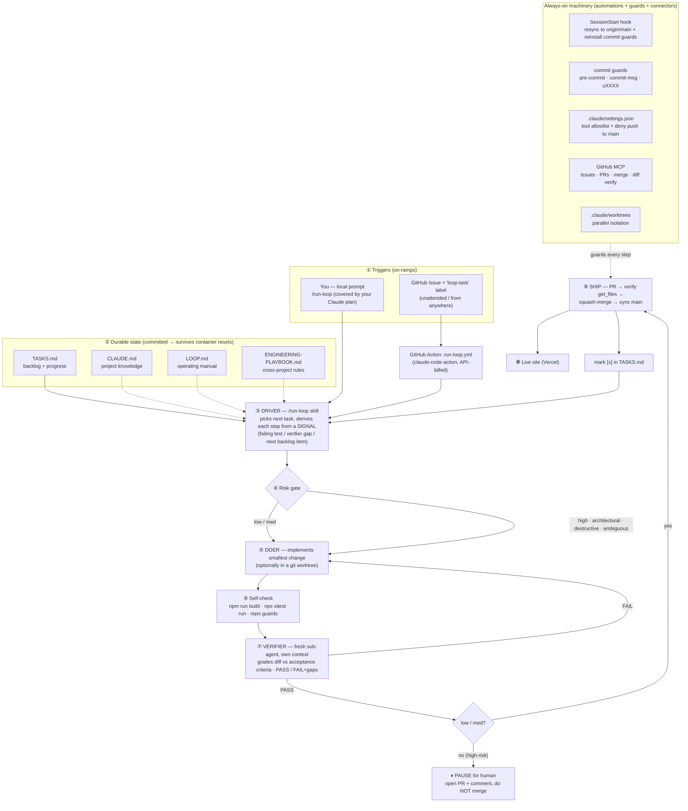
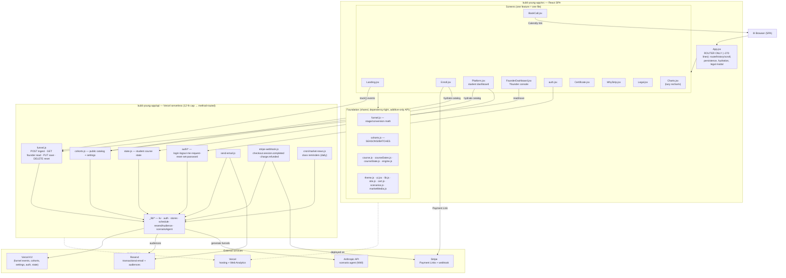

# Build Young — Architecture

Two systems live in this repo, and this document maps both:

1. **The agentic engineering system** — how a goal becomes a shipped change to the live site,
   mostly without per-step prompting (the "loop"). See also [`LOOP.md`](./LOOP.md).
2. **The application** — the React marketing site + enrollment + course dashboard, its serverless
   API, and the external services it talks to. See also [`build-young-app/CLAUDE.md`](./build-young-app/CLAUDE.md).

> The diagrams below are **Mermaid** — they render as real diagrams on GitHub (open this file there),
> and they're plain text so an agent can edit them in the same PR that changes the architecture.
> **Living-document rule:** any PR that adds/removes/moves a module, endpoint, skill, hook, or
> external service — or changes how the loop/ship flow works — **updates this file in the same PR.**

---

## 1. The agentic engineering system (the loop)

How work gets done here: you write a **goal** (a task), and the loop drives it to the live site —
implement → verify (independently) → ship — pausing only on the conditions noted below.

| Node | What it is / its responsibility |
|---|---|
| **Triggers** | Two on-ramps to the same driver. **Local `/run-loop`** (runs in your Claude Code, covered by your subscription) and an **issue-triggered GitHub Action** (`.github/workflows/run-loop.yml`, gated by the `loop-task` label, billed to Anthropic API credits). Same procedure either way. |
| **Durable state** | Committed files the loop reads/writes so a fresh container resumes where it stopped: `TASKS.md` (queue + done log), `CLAUDE.md` (project rules/module map), `LOOP.md` (manual), `ENGINEERING-PLAYBOOK.md` (portable rules). |
| **Driver** (`.claude/skills/run-loop`) | The orchestrator. Picks the first unchecked task and drives it; never guesses the next step — it comes from a **signal** (failing build/test, verifier gap report, or the next backlog item). |
| **Risk gate** | Reads the task's `risk:`. Everything is implemented; only the **merge** decision differs (see ship gate). |
| **Doer** | Writes the smallest change that meets the acceptance criteria, staying in the task's file lane. May run in a **worktree**-isolated sub-agent for parallel work. |
| **Self-check** | `npm run build` + `npx vitest run` + repo guards (no `\uXXXX`, no internal model id, no resurrected money-sim markers). Fix until green. |
| **Verifier** | A **fresh sub-agent** in its own context, given only the acceptance criteria + the diff. It independently re-runs build/tests and returns **PASS** or **FAIL + gaps**. The doer can't grade its own homework. ~3 rounds, then stop. |
| **Ship** | Commit (author `Claude <noreply@anthropic.com>`) → push dev branch → open PR → **verify the PR's file diff is non-empty** → squash-merge → sync `main` and re-push the dev branch. |
| **Ship gate / Pause** | **low/med** → auto squash-merge to the live site. **high / architectural / destructive / outward-facing / ambiguous** → leave the PR open, comment why, and **stop for human review**. |
| **Machinery** | The SessionStart hook (state resurrection: resync + reinstall guards), the commit guards, the settings allowlist (and the deny-push-to-`main` rule), the **GitHub MCP** connector, and worktrees for isolation. |

**Stop conditions** (the loop bounces back to you instead of merging): `risk: high`, a destructive/
irreversible/outward-facing action, an ambiguous/underspecified task, or a verifier that keeps
failing. Detail in [`LOOP.md`](./LOOP.md) and [`.claude/skills/run-loop/SKILL.md`](./.claude/skills/run-loop/SKILL.md).

There is also a **second automation** that predates the loop: [`.github/workflows/content-integrity.yml`](./.github/workflows/content-integrity.yml)
— a weekly scheduled agent that verifies curriculum links/stats and opens a PR for human review
(it never merges).

---

## 2. The application

A React 18 + Vite single-page app (`build-young-app/`) with a thin router, per-feature screen
modules, dependency-light foundation modules, and Vercel **serverless functions** under `api/` that
talk to KV and a few external services.

| Node | Responsibility |
|---|---|
| **App.jsx** | The router only — route/history stack, scroll restore, the single-flight `navLock`, persistence/hydration, and the legal modal. New features go in their own file, never back here. |
| **Screens** | One feature per file: `Landing` (marketing), `Enroll` (3-step), `BookCall` (intro call), `Platform` (student dashboard + course hub), `FounderDashboard` (hidden `?founder` analytics/admin console), `auth` (login/set-password), `Certificate` (cert + public `/verify`), `WhyStrip` (social-proof strips), `Legal` (privacy/terms modal), `Charts` (lazy-loaded recharts). |
| **Foundation** | Shared, dependency-light single-sources-of-truth — imported by everything, so changes are **additive-only** during parallel work: `funnel.js` (stage/conversion/revenue math), `cohorts.js` (`SEASONS`/`BATCHES`), `course*.js`/`engine.js` (curriculum + week progression), `theme/ui/lib/site/cert/scenarios/marketMedia`. |
| **api/funnel.js** | One method-routed endpoint (Hobby 12-function cap): **POST** public event ingest, **GET** founder funnel read, **PUT** saves cohorts/allowlist/settings, **DELETE** resets a test account. Non-POST requires a founder session. |
| **api/cohorts.js** | Public read of the live catalog (`batches`, `checkins`, `settings`) so clients hydrate cohorts + site settings without a redeploy. |
| **api/state.js · auth/\*** | Student course state; account auth (login/logout/me/reset/set-password) — founder gating via `FOUNDER_EMAILS`. |
| **api/stripe-webhook.js** | Enrollment lifecycle: `checkout.session.completed` adds the student (+ Resend audience); `charge.refunded` removes enrollment + audience contact. |
| **api/cron/market-news.js** | Daily cron — a "prepare for next week" class reminder 2 days before each class (NOT a market-news drip; that was removed). |
| **api/_lib/\*** | Server internals: `kv` (Vercel KV client), `auth`, the KV-backed stores, `schedule`, `resendAudience`, and `scenarioAgent` (calls the Anthropic API to generate Week-9 practice funnels; key stays server-side, founder-toggleable). |
| **External services** | **Vercel KV** (all persisted state), **Stripe** (Payment Links + webhook), **Resend** (email + broadcast audiences, key-gated/best-effort), **Vercel** (hosting + cookieless Web Analytics), **Anthropic API** (the scenario agent). Secrets stay env-only. |

For deeper detail on any node, see [`build-young-app/CLAUDE.md`](./build-young-app/CLAUDE.md) (module map,
quality bars, navigation/perf invariants) and [`LOOP.md`](./LOOP.md) (the loop).
