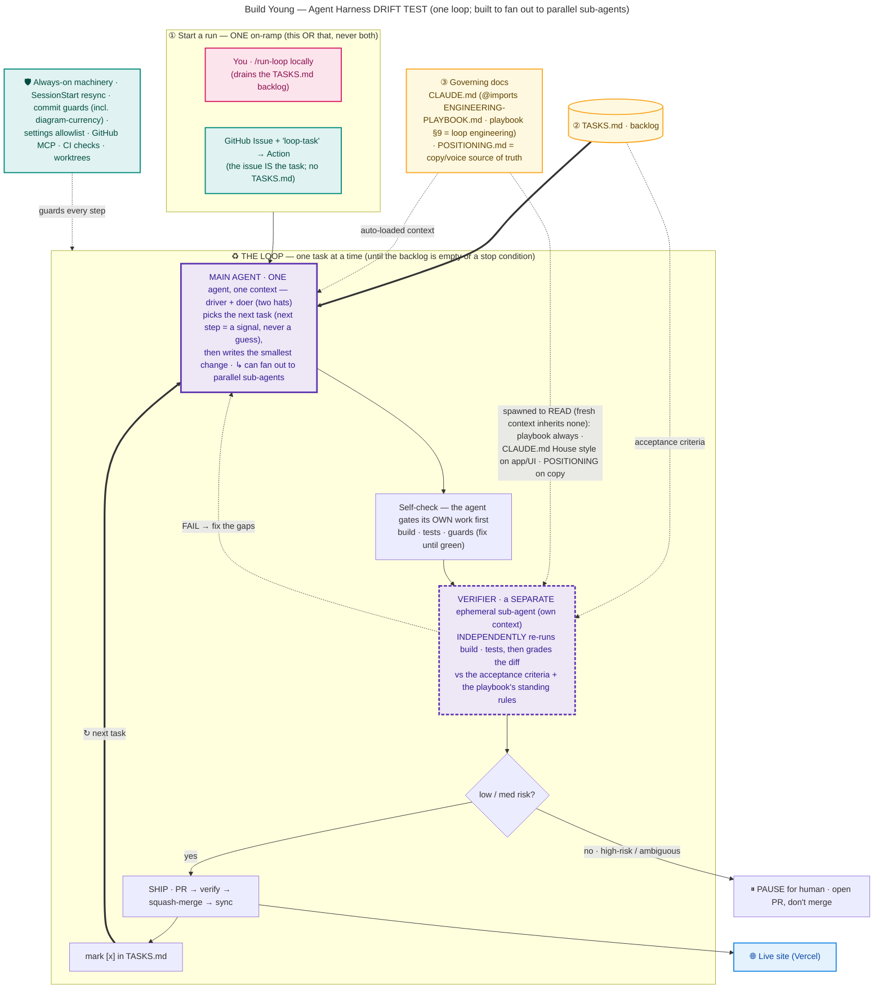
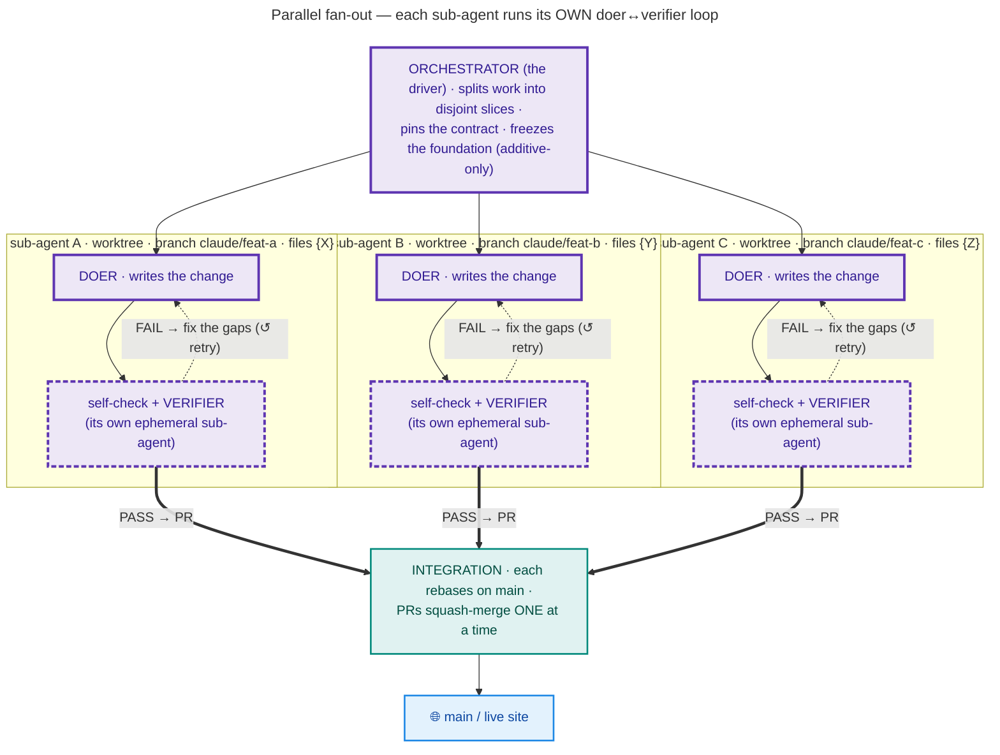
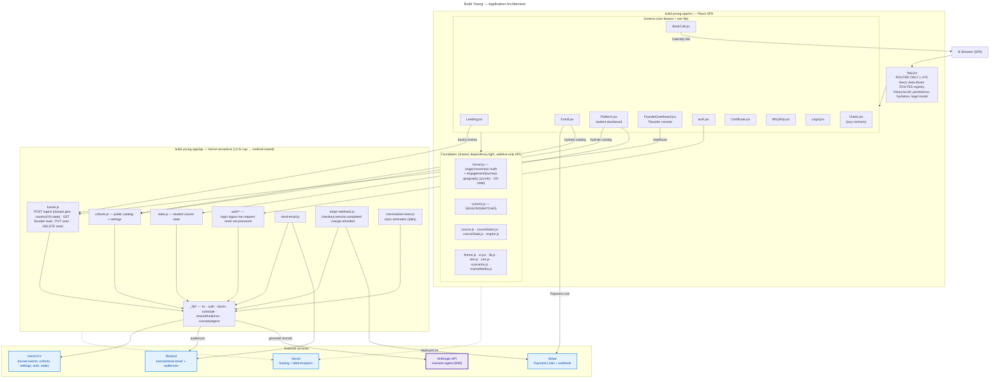

# Build Young — Architecture

Two systems live in this repo, and this document maps both:

1. **The agentic engineering system** — how a goal becomes a shipped change to the live site,
   mostly without per-step prompting (the "loop"). See also [`ENGINEERING-PLAYBOOK.md`](./ENGINEERING-PLAYBOOK.md) §9 "Loop engineering".
2. **The application** — the React marketing site + enrollment + course dashboard, its serverless
   API, and the external services it talks to. See also [`build-young-app/CLAUDE.md`](./build-young-app/CLAUDE.md).

> The diagrams below are **Mermaid** — they render as real diagrams on GitHub (open this file there),
> and they're plain text so an agent can edit them in the same PR that changes the architecture.
> **Living-document rule:** any PR that adds/removes/moves a module, endpoint, skill, hook, or
> external service — or changes how the loop/ship flow works — **updates this file in the same PR.**
>
> **Node colors:** purple = an **AI agent** (dashed = an *ephemeral spawned sub-agent*), teal = **tool /
> automation**, amber = **committed state**, blue = **external service**, pink = **human**. (Kept as a
> text key rather than an in-diagram legend so the diagrams stay compact — no floating legend box.)
>
> **Rendered exports (zoomable):** [`docs/architecture/loop.pdf`](docs/architecture/loop.pdf) ·
> [`parallel.pdf`](docs/architecture/parallel.pdf) · [`app.pdf`](docs/architecture/app.pdf) (PNG previews alongside). They're for places that don't render
> Mermaid (chat, decks, the app). **When you edit a Mermaid block here, regenerate them in the SAME
> change:** `bash scripts/render-architecture.sh`.

---

## 1. The agentic engineering system (the loop)

How work gets done here: you write a **goal** (a task), and the loop drives it to the live site —
implement → verify (independently) → ship — pausing only on the conditions noted below.

| Node | What it is / its responsibility |
|---|---|
| **Triggers** | Two on-ramps to the same driver — **use one OR the other for a given task, never both.** **Local `/run-loop`** (runs in your Claude Code on your subscription; drains the `TASKS.md` backlog) **or** the **issue-triggered GitHub Action** (`.github/workflows/run-loop.yml`, gated by the `loop-task` label, billed to Anthropic API credits; the **issue itself is the task** — it doesn't read `TASKS.md`). Same procedure once started. |
| **Durable state** | Committed files the loop reads/writes so a fresh container resumes where it stopped: `TASKS.md` (queue + done log), `CLAUDE.md` (project rules/module map), `POSITIONING.md` (copy & voice source of truth), `ENGINEERING-PLAYBOOK.md` (portable rules + §9 loop engineering). |
| **Driver + Doer** (`.claude/skills/run-loop`) | **The same agent, one context, two hats.** As *driver* it picks the first unchecked task and never guesses the next step — it comes from a **signal** (failing build/test, verifier gap, or the next backlog item); as *doer* it writes the smallest change that meets the acceptance criteria, staying in the task's file lane. (The doer *may* fan out to a **worktree**-isolated sub-agent for parallel work — the exception, not the default.) Runs on the **premium tier** — it's the planning/reasoning seat (and high-risk tasks live here); the cheaper tier is for the verifier + low-risk mechanical passes. |
| **Risk gate** | Reads the task's `risk:`. Everything is implemented; only the **merge** decision differs (see ship gate). |
| **Self-check** | `npm run build` + `npx vitest run` + repo guards (no `\uXXXX`, no internal model id, no resurrected money-sim markers). Fix until green. |
| **Verifier** | A **fresh, ephemeral sub-agent** in its own context. It **inherits none of the driver/doer's auto-loaded context** (no `CLAUDE.md`, no `@imports`) — so the spawn prompt must hand it everything: the task's acceptance criteria (`TASKS.md`) + the diff, **and an explicit instruction to read** `ENGINEERING-PLAYBOOK.md` (portable standing rules — §3 diagram/doc + §4 shipping), **`build-young-app/CLAUDE.md` when the diff touches the app/UI** (the project guide's **House style** — e.g. optimize for less scrolling, no flag/emoji glyphs, statistics integrity — plus the module map + quality bars), **and `POSITIONING.md` when the diff touches user-facing copy** (the voice/claims source of truth). A rule is enforced without editing the skills as long as it lives in the doc the verifier is told to read (portable → playbook, project-specific → CLAUDE.md). That's *how it knows to read them* — it's told, because it can't auto-load them. It independently re-runs build/tests and grades the diff against the criteria **and** those standing rules → **PASS** or **FAIL + gaps**. The doer can't grade its own homework. ~3 rounds, then stop. **Runs on the cheaper model tier** (Sonnet-class — `model: "sonnet"`): cost discipline, rigor unchanged (every standing rule + FAIL→fix retry). See [model tiering](./build-young-app/CLAUDE.md) / playbook §9. |
| **Ship** | Commit (author `Claude <noreply@anthropic.com>`) → push dev branch → open PR → **verify the PR's file diff is non-empty** → squash-merge → sync `main` and re-push the dev branch. |
| **Ship gate / Pause** | **low/med** → auto squash-merge to the live site. **high / architectural / destructive / outward-facing / ambiguous** → leave the PR open, comment why, and **stop for human review**. |
| **Machinery** | The SessionStart hook (state resurrection: resync + reinstall guards), the commit guards, the settings allowlist (and the deny-push-to-`main` rule), the **GitHub MCP** connector, and worktrees for isolation. |

**Stop conditions** (the loop bounces back to you instead of merging): `risk: high`, a destructive/
irreversible/outward-facing action, an ambiguous/underspecified task, or a verifier that keeps
failing. Detail in [`ENGINEERING-PLAYBOOK.md`](./ENGINEERING-PLAYBOOK.md) §9 and [`.claude/skills/run-loop/SKILL.md`](./.claude/skills/run-loop/SKILL.md).

There is also a **second automation** that predates the loop: [`.github/workflows/content-integrity.yml`](./.github/workflows/content-integrity.yml)
— a weekly scheduled agent that verifies curriculum links/stats and opens a PR for human review
(it never merges).

---

## 1a. Parallel fan-out — the same harness, optimized for sub-agents

The loop above runs **sequentially** (one task at a time). But the architecture is **built to fan out**:
when several tasks are independent, the orchestrator runs them as **parallel sub-agents**, each in its
own git worktree, converging on a one-at-a-time merge.

**Each branch is the full loop, not a one-shot** — every sub-agent runs the same **doer → self-check →
verifier** cycle (with the **FAIL → fix → re-verify** retry from the main loop), just on its own slice.
**They never share a file or talk to each other** — each has its own context + git worktree. Coordination
is the **contract** (seams pinned up front) + the **serialized merge order**, not inter-agent chat.

**When the harness fans out (the decision rule):** default is **sequential**; the orchestrator parallelizes
**only when ALL hold** — (1) ≥2 tasks on **disjoint files**, (2) **no foundation change** mid-flight
(foundation changes go first, serially), (3) **no ordering dependency** between them, (4) the **contract is
pinnable** up front. Any miss → sequential. Borderline → ask the human; you can override either way. The four
guard-rails (one feature = one file · freeze the foundation · contract-first · merge one-at-a-time) live in
[`build-young-app/CLAUDE.md`](./build-young-app/CLAUDE.md) → "Parallel work protocol."

---

## 2. The application

A React 18 + Vite single-page app (`build-young-app/`) with a thin router, per-feature screen
modules, dependency-light foundation modules, and Vercel **serverless functions** under `api/` that
talk to KV and a few external services.

| Node | Responsibility |
|---|---|
| **App.jsx** | The router only — a **data-driven `ROUTES` registry** (`{key, path, title, desc, el}`) drives both the render and the URL/`<title>`, so adding a screen is one appended entry. Owns the route/history stack, scroll restore, the single-flight `navLock`, persistence/hydration, and the legal modal. New features go in their own file, never back here. |
| **Screens** | One feature per file: `Landing` (marketing), `Enroll` (3-step), `BookCall` (intro call), `Platform` (student dashboard + course hub), `FounderDashboard` (hidden `?founder` analytics/admin console), `auth` (login/set-password), `Certificate` (cert + public `/verify`), `WhyStrip` (social-proof strips), `Legal` (privacy/terms modal), `Charts` (lazy-loaded recharts). |
| **Foundation** | Shared, dependency-light single-sources-of-truth — imported by everything, so changes are **additive-only** during parallel work: `funnel.js` (stage/conversion/revenue math + traffic geography — country & US-state), `cohorts.js` (`SEASONS`/`BATCHES`), `course*.js`/`engine.js` (curriculum + week progression), `theme/ui/lib/site/cert/scenarios/marketMedia`. |
| **api/funnel.js** | One method-routed endpoint (Hobby 12-function cap): **POST** public event ingest, **GET** founder funnel read, **PUT** saves cohorts/allowlist/settings, **DELETE** resets a test account. Non-POST requires a founder session. |
| **api/cohorts.js** | Public read of the live catalog (`batches`, `checkins`, `settings`) so clients hydrate cohorts + site settings without a redeploy. |
| **api/state.js · auth/\*** | Student course state; account auth (login/logout/me/reset/set-password) — founder gating via `FOUNDER_EMAILS`. |
| **api/stripe-webhook.js** | Enrollment lifecycle: `checkout.session.completed` adds the student (+ Resend audience); `charge.refunded` removes enrollment + audience contact. |
| **api/cron/market-news.js** | Daily cron — a "prepare for next week" class reminder 2 days before each class (NOT a market-news drip; that was removed). |
| **api/_lib/\*** | Server internals: `kv` (Vercel KV client), `auth`, the KV-backed stores, `schedule`, `resendAudience`, and `scenarioAgent` (calls the Anthropic API to generate Week-9 practice funnels; key stays server-side, founder-toggleable). |
| **External services** | **Vercel KV** (all persisted state), **Stripe** (Payment Links + webhook), **Resend** (email + broadcast audiences, key-gated/best-effort), **Vercel** (hosting + cookieless Web Analytics), **Anthropic API** (the scenario agent). Secrets stay env-only. |

For deeper detail on any node, see [`build-young-app/CLAUDE.md`](./build-young-app/CLAUDE.md) (module map,
quality bars, navigation/perf invariants) and [`ENGINEERING-PLAYBOOK.md`](./ENGINEERING-PLAYBOOK.md) §9 (loop engineering).

---

## Acceptance criteria for this doc (so changes can be *verified*, not just eyeballed)

The "done" conditions for any change to `BUILD-YOUNG-ARCHITECTURE.md` — most are objectively checkable (by the
loop's verifier or a grep), which is what keeps diagram edits from turning into back-and-forth:

- **Both layers present:** the agentic loop AND the app, each with a Mermaid diagram + a component table.
- **No invented nodes:** every node maps to a real artifact in the repo (module / endpoint / skill /
  hook / external service); names match the code.
- **The loop reads as a loop:** the loop diagram has the explicit return edge closing `record → agent`
  (plus the verifier→agent FAIL retry) — not a top-to-bottom pipeline.
- **Visual taxonomy:** agents, ephemeral sub-agents, tools/automation, committed state, external
  services, and humans are styled distinctly (the `classDef`s). The color meaning is stated once as a
  **text key** in the intro — *not* as an in-diagram `Legend` subgraph (a disconnected legend node is a
  whitespace trap: dagre floats it off to one side and stretches the canvas, leaving a large empty
  quadrant). Keep the key out of the diagram.
- **Compact — no large empty regions, readable without zooming.** When you change a Mermaid block,
  **VIEW the regenerated PNG** (the verifier does this — it can Read the image) and confirm the content
  fills the frame: no big empty quadrant, no disconnected node stretching the canvas, no need to zoom to
  read a node. If there's a dead region, fix the cause (most common: a disconnected/`~~~`-chained node,
  or `LR` where `TB` packs tighter) — don't ship it and don't defer it to a human to flag. This is a
  *done-condition*, not a nicety.
- **The verifier shows its inputs:** the diff (from the doer) AND the acceptance-criteria source (`TASKS.md`).
- **Exports current (mechanically enforced):** `docs/architecture/*.png|pdf` were regenerated from these
  Mermaid blocks in the SAME change (`scripts/render-architecture.sh`) and render with no Mermaid syntax
  error. This isn't left to memory: the renderer records a hash of the Mermaid source, and
  `scripts/check-architecture-current.sh` (run by the **commit guard** and the **`architecture-current`
  CI check**) **blocks** a commit/merge where the source changed but the exports weren't regenerated.
- **Cross-linked:** links to `CLAUDE.md` / `ENGINEERING-PLAYBOOK.md` for depth.

Almost everything above is checkable — by a grep, a re-render, or the verifier **viewing the PNG** —
so the loop grades a diagram change (including its visual compactness) instead of bouncing it to you.
The only bit that still needs a human eye is the subjective "is the *story* right?"
