# Build Young — Architecture

Two systems live in this repo, and this document maps both:

1. **The agentic engineering system** — how a goal becomes a shipped change to the live site,
   mostly without per-step prompting (the "loop"). See also [`ENGINEERING-PLAYBOOK.md`](./ENGINEERING-PLAYBOOK.md) §9 "Loop engineering".
2. **The application** — the React marketing site + enrollment + course dashboard, its serverless
   API, and the external services it talks to. See also [`build-young-app/CLAUDE.md`](./build-young-app/CLAUDE.md).

> Two diagrams, two sources (both render on GitHub): the **loop** is a **hand-authored SVG**
> (`docs/architecture/loop.svg`) — chosen for full layout control (numbered flow, callout pinned
> top-right); the **app** is a **Mermaid** block (plain text, auto-rendered). **Living-document rule:**
> any PR that adds/removes/moves a module, endpoint, skill, hook, or external service — or changes how
> the loop/ship flow works — **updates this file (and the relevant diagram source) in the same PR.**
>
> **Node colors:** purple = an **AI agent** (dashed = an *ephemeral spawned sub-agent*), teal = **tool /
> automation**, amber = **committed state**, blue = **external service**, pink = **human**. (Kept as a
> text key rather than an in-diagram legend so the diagrams stay compact — no floating legend box.)
>
> **Rendered exports (zoomable):** [`docs/architecture/loop.pdf`](docs/architecture/loop.pdf) ·
> [`app.pdf`](docs/architecture/app.pdf) (PNG previews alongside) — for places that don't render the
> source (chat, decks, the app); the PDF is what we hand to people. **When you edit `loop.svg` OR the
> app Mermaid block, regenerate in the SAME change:** `bash scripts/render-architecture.sh`.

---

## 1. The agentic engineering system (the loop)

How work gets done here: you write a **goal** (a task), and the loop drives it to the live site —
implement → verify (independently) → ship — pausing only on the conditions noted below.

> **This diagram is a hand-authored SVG** (`docs/architecture/loop.svg`) — chosen over Mermaid for full
> layout control (numbered flow, the callout pinned top-right). **Edit the SVG by hand, then run
> `bash scripts/render-architecture.sh`** to regenerate `loop.png`/`loop.pdf` (the currency guard hashes
> the SVG, so a stale export fails the check). The **app** diagram below stays Mermaid.

| Node | What it is / its responsibility |
|---|---|
| **Triggers** | Two on-ramps to the same driver — **use one OR the other for a given task, never both.** **Local `/run-loop`** (runs in your Claude Code on your subscription; drains the `TASKS.md` backlog) **or** the **issue-triggered GitHub Action** (`.github/workflows/run-loop.yml`, gated by the `loop-task` label, billed to Anthropic API credits; the **issue itself is the task** — it doesn't read `TASKS.md`). Same procedure once started. |
| **Durable state** | Committed files the loop reads/writes so a fresh container resumes where it stopped: `TASKS.md` (queue + done log), `CLAUDE.md` (project rules/module map), `POSITIONING.md` (copy & voice source of truth), `ENGINEERING-PLAYBOOK.md` (portable rules + §9 loop engineering). |
| **Driver + Doer** (`.claude/skills/run-loop`) | **The same agent, one context, two hats.** As *driver* it picks the first unchecked task and never guesses the next step — it comes from a **signal** (failing build/test, verifier gap, or the next backlog item); as *doer* it writes the smallest change that meets the acceptance criteria, staying in the task's file lane. (The doer *may* fan out to a **worktree**-isolated sub-agent for parallel work — the exception, not the default.) Runs on the **premium tier** — it's the planning/reasoning seat (and high-risk tasks live here); the cheaper tier is for the verifier + low-risk mechanical passes. |
| **Risk gate** | Reads the task's `risk:`. Everything is implemented; only the **merge** decision differs (see ship gate). |
| **Self-check** | `npm run build` + `npx vitest run` + repo guards (no `\uXXXX`, no internal model id, no resurrected money-sim markers). Fix until green. |
| **Verifier** | A **fresh, ephemeral sub-agent** in its own context. It **inherits none of the driver/doer's auto-loaded context** (no `CLAUDE.md`, no `@imports`) — so the spawn prompt must hand it everything: the task's acceptance criteria (`TASKS.md`) + the diff, **and an explicit instruction to read** `ENGINEERING-PLAYBOOK.md` (portable standing rules — §3 diagram/doc + §4 shipping), **`build-young-app/CLAUDE.md` when the diff touches the app/UI** (the project guide's **House style** — e.g. optimize for less scrolling, no flag/emoji glyphs, statistics integrity — plus the module map + quality bars), **and `POSITIONING.md` when the diff touches user-facing copy** (the voice/claims source of truth). A rule is enforced without editing the skills as long as it lives in the doc the verifier is told to read (portable → playbook, project-specific → CLAUDE.md). That's *how it knows to read them* — it's told, because it can't auto-load them. It independently re-runs build/tests and grades the diff against the criteria **and** those standing rules → **PASS** or **FAIL + gaps**. The doer can't grade its own homework. ~3 rounds, then stop. **Runs on the cheaper model tier** (Sonnet-class — `model: "sonnet"`): cost discipline, rigor unchanged (every standing rule + FAIL→fix retry). See [model tiering](./build-young-app/CLAUDE.md) / playbook §9. |
| **Ship** | Commit (author `Claude <noreply@anthropic.com>`) → push dev branch → open PR → **verify the PR's file diff is non-empty** → squash-merge → sync `main` and re-push the dev branch. |
| **Ship gate / Pause** | **low/med** → auto squash-merge to the live site. **high / architectural / destructive / outward-facing / ambiguous** → leave the PR open, comment why, and **stop for human review**. |
| **Machinery** | The SessionStart hook (state resurrection: resync + reinstall guards), the commit guards (incl. the **diagram-currency** check — `scripts/check-architecture-current.sh`), **CI checks** (e.g. `architecture-current` blocks a merge with a stale diagram; `landing-lean` blocks a merge that re-inflates the landing page past its T13 height ceiling), the settings allowlist (and the deny-push-to-`main` rule), the **GitHub MCP** connector, and worktrees for isolation. |

**Stop conditions** (the loop bounces back to you instead of merging): `risk: high`, a destructive/
irreversible/outward-facing action, an ambiguous/underspecified task, or a verifier that keeps
failing. Detail in [`ENGINEERING-PLAYBOOK.md`](./ENGINEERING-PLAYBOOK.md) §9 and [`.claude/skills/run-loop/SKILL.md`](./.claude/skills/run-loop/SKILL.md).

There is also a **second automation** that predates the loop: [`.github/workflows/content-integrity.yml`](./.github/workflows/content-integrity.yml)
— a weekly scheduled agent that verifies curriculum links/stats and opens a PR for human review
(it never merges).

---

## 1a. Parallel fan-out — the same harness, optimized for sub-agents

Parallelism is **not a second system** — it's the same loop, fanned out, so it lives **inside the loop
diagram above** (the **FAN-OUT** node) rather than as a separate diagram (one diagram = one artifact to
keep in sync). The loop runs **sequentially** by default (one task at a time); when several tasks are
independent, the orchestrator (the driver) spawns **parallel sub-agents**, each in its own git worktree
on its own branch, **each running THIS same doer → self-check → verifier loop**, converging on a
one-at-a-time merge.

**Each branch is the full loop, not a one-shot** — every sub-agent runs the same **doer → self-check →
verifier** cycle (with the **FAIL → fix → re-verify** retry from the main loop), just on its own slice.
**They never share a file or talk to each other** — each has its own context + git worktree. Coordination
is the **contract** (seams pinned up front) + the **serialized merge order**, not inter-agent chat.

**When the harness fans out (the decision rule):** default is **sequential**; the orchestrator parallelizes
**only when ALL hold** — (1) ≥2 tasks on **disjoint files**, (2) **no foundation change** mid-flight
(foundation changes go first, serially), (3) **no ordering dependency** between them, (4) the **contract is
pinnable** up front. Any miss → sequential. Borderline → ask the human; you can override either way. The four
guard-rails (one feature = one file · freeze the foundation · contract-first · merge one-at-a-time) live in
[`build-young-app/CLAUDE.md`](./build-young-app/CLAUDE.md) → "Parallel work protocol."

**Where the `Files:` hint comes from — and why not from you.** This is a deliberate division of labour:
**you work at the intent level** ("cut the scrolling", "make GitHub a core component") and own the backlog +
the risk/positioning calls — you haven't needed to read the code. **The agent built the system and holds its
structure** (the `CLAUDE.md` **module map** *is* that model, kept current), so the **driver writes the
`Files:` hint** when it records your request as a task — asking someone who hasn't read the code for file
paths would make no sense. Because the *same* agent authors the hint **and** could act on it, safety never
rests on the hint: the **default is sequential**, the **module map is the ground truth**, a doer that needs an
un-owned file **stops and surfaces** (no cross-boundary edits), **you approve the backlog**, and the
independent **verifier** grades the result — so a wrong/missing hint just stays sequential or pauses.

---

## 2. The application

A React 18 + Vite single-page app (`build-young-app/`) with a thin router, per-feature screen
modules, dependency-light foundation modules, and Vercel **serverless functions** under `api/` that
talk to KV and a few external services.

```mermaid
---
title: Build Young — Application Architecture
---
flowchart TB
    browser["🌐 Browser (SPA)"]

    subgraph app["build-young-app/src — React SPA"]
        appjsx["App.jsx<br/>ROUTER ONLY (~375 lines): data-driven ROUTES registry,<br/>history/scroll, persistence, hydration, legal modal"]
        subgraph screens["Screens (one feature = one file)"]
            landing["Landing.jsx"]
            about["About.jsx<br/>our story / founder essay"]
            curric["Curriculum.jsx<br/>how it works / 3 acts"]
            faq["Faq.jsx<br/>FAQ + ask a question"]
            enroll["Enroll.jsx"]
            book["BookCall.jsx"]
            platform["Platform.jsx<br/>student dashboard"]
            founder["FounderDashboard.jsx<br/>?founder console"]
            authui["auth.jsx"]
            certui["Certificate.jsx"]
            why["WhyStrip.jsx"]
            legal["Legal.jsx"]
            charts["Charts.jsx<br/>(lazy recharts)"]
        end
        subgraph foundation["Foundation (shared, dependency-light, additive-only API)"]
            funnel["funnel.js — stage/conversion math<br/>+ engagement/journeys geography (country · US-state)"]
            cohortsjs["cohorts.js — SEASONS/BATCHES"]
            coursejs["course.js · courseDates.js · courseState.js · engine.js"]
            data["theme.js · ui.jsx · lib.js · site.js · cert.js · scenarios.js · marketMedia.js"]
        end
    end

    subgraph api["build-young-app/api — Vercel serverless (12-fn cap → method-routed)"]
        funnelapi["funnel.js<br/>POST ingest (stamps geo: country/US-state) · GET founder read · PUT save · DELETE reset"]
        cohortsapi["cohorts.js — public catalog + settings"]
        stateapi["state.js — student course state"]
        authapi["auth/* — login·logout·me·request-reset·set-password"]
        emailapi["send-email.js"]
        stripeapi["stripe-webhook.js<br/>checkout.session.completed · charge.refunded"]
        cron["cron/market-news.js<br/>class reminders (daily)"]
        lib["_lib/* — kv · auth · stores · schedule ·<br/>resendAudience · scenarioAgent"]
    end

    subgraph ext["External services"]
        kv["Vercel KV<br/>(funnel events, cohorts, settings, auth, state)"]
        stripe["Stripe<br/>Payment Links + webhook"]
        resend["Resend<br/>transactional email + audiences"]
        vercel["Vercel<br/>hosting + Web Analytics"]
        anthropic["Anthropic API<br/>scenario agent (Wk9)"]
    end

    browser --> appjsx
    appjsx --> screens
    screens --> foundation
    landing -->|"Read our story"| about
    landing -->|"See the 12 weeks"| curric
    landing -->|"Read the FAQ"| faq
    landing -->|"track() events"| funnelapi
    enroll -->|"Payment Link"| stripe
    enroll & platform -->|"hydrate catalog"| cohortsapi
    platform --> stateapi
    authui --> authapi
    founder -->|"read/save"| funnelapi
    book -->|"Calendly link"| browser

    funnelapi & cohortsapi & stateapi & authapi & emailapi & stripeapi & cron --> lib
    lib --> kv
    stripeapi --> stripe
    emailapi --> resend
    lib -->|"audiences"| resend
    lib -->|"generate funnels"| anthropic
    app -.deployed on.-> vercel
    api -.deployed on.-> vercel

    %% ── same taxonomy: the Anthropic scenario-agent is an AI agent; the rest are external services / code ──
    classDef agent fill:#ede7f6,stroke:#5e35b1,stroke-width:3px,color:#311b92;
    classDef ext fill:#e3f2fd,stroke:#1e88e5,stroke-width:2px,color:#0d47a1;
    class anthropic agent;
    class kv,stripe,resend,vercel ext;
```

| Node | Responsibility |
|---|---|
| **App.jsx** | The router only — a **data-driven `ROUTES` registry** (`{key, path, title, desc, el}`) drives both the render and the URL/`<title>`, so adding a screen is one appended entry. Owns the route/history stack, scroll restore, the single-flight `navLock`, persistence/hydration, and the legal modal. New features go in their own file, never back here. |
| **Screens** | One feature per file: `Landing` (lean marketing funnel entry), `About` (`/about` — founder essay + "more than money"), `Curriculum` (`/curriculum` — 3-act "how it works" + where-the-work detail), `Faq` (`/faq` — full Q&A + ask form) — the last three were split off `Landing` to cut its scroll ~60% (T13); `Enroll` (3-step), `BookCall` (intro call), `Platform` (student dashboard + course hub), `FounderDashboard` (hidden `?founder` analytics/admin console), `auth` (login/set-password), `Certificate` (cert + public `/verify`), `WhyStrip` (social-proof strips), `Legal` (privacy/terms modal), `Charts` (lazy-loaded recharts). |
| **Foundation** | Shared, dependency-light single-sources-of-truth — imported by everything, so changes are **additive-only** during parallel work: `funnel.js` (stage/conversion/revenue math + traffic geography — country & US-state), `cohorts.js` (`SEASONS`/`BATCHES`), `course*.js`/`engine.js` (curriculum + week progression), `theme/ui/lib/site/cert/scenarios/marketMedia`. |
| **api/funnel.js** | One method-routed endpoint (Hobby 12-function cap): **POST** public event ingest, **GET** founder funnel read, **PUT** saves cohorts/allowlist/settings, **DELETE** resets a test account. Non-POST requires a founder session. |
| **api/cohorts.js** | Public read of the live catalog (`batches`, `checkins`, `settings`) so clients hydrate cohorts + site settings without a redeploy. |
| **api/state.js · auth/\*** | Student course state; account auth (login/logout/me/reset/set-password) — founder gating via `FOUNDER_EMAILS`. |
| **api/stripe-webhook.js** | Enrollment lifecycle: `checkout.session.completed` adds the student (+ Resend audience); `charge.refunded` removes enrollment + audience contact. |
| **api/cron/market-news.js** | Daily cron — a "prepare for next week" class reminder 2 days before each class (NOT a market-news drip; that was removed). |
| **api/_lib/\*** | Server internals: `kv` (Vercel KV client), `auth`, the KV-backed stores, `schedule`, `resendAudience`, and `scenarioAgent` (calls the Anthropic API to generate Week-9 practice funnels; key stays server-side, founder-toggleable). |
| **External services** | **Vercel KV** (all persisted state), **Stripe** (Payment Links + webhook), **Resend** (email + broadcast audiences, key-gated/best-effort), **Vercel** (hosting + cookieless Web Analytics), **Anthropic API** (the scenario agent). Secrets stay env-only. |

For deeper detail on any node, see [`build-young-app/CLAUDE.md`](./build-young-app/CLAUDE.md) (module map,
quality bars, navigation/perf invariants) and [`ENGINEERING-PLAYBOOK.md`](./ENGINEERING-PLAYBOOK.md) §9 (loop engineering).

---

## 3. Key design & implementation decisions (and *why*)

The decisions worth defending — each is a deliberate trade-off, not an accident.

### A. The agentic engineering system
- **A custom `/run-loop` skill is the driver.** The autonomous loop isn't ad-hoc prompting — it's a
  committed Claude Code skill (`.claude/skills/run-loop`) that *defines the procedure* (pick → implement
  → self-check → spawn verifier → ship → record → next). *Why:* the next step comes from a **feedback
  signal** (a failing test, a verifier gap, the next backlog item), never a guess — that's what makes
  unattended progress reliable instead of drifting.
- **Doer ⇄ verifier split (independent, fresh context).** Every change is graded by a *separate*
  ephemeral sub-agent that inherits none of the doer's context, re-runs build/tests, and checks the diff
  against the rules it's explicitly told to read. *Why:* the doer can't grade its own homework; a
  fresh context is what makes the check honest.
- **Isolated subagents over "agent teams."** We coordinate with **isolated, report-back subagents** (the
  verifier, fan-out workers) + a **serialized one-at-a-time merge** — *not* Claude Code's (experimental,
  off-by-default) **Agent Teams**, where peers message each other and self-coordinate over a shared task
  list. *Why:* parallel agents' failure mode is **silent conflicts**, so isolation + contract-first +
  a serialized merge buys determinism (and lower token cost) where a chattier team buys collaboration we
  don't need; the orchestrator holds coordination, not inter-agent chat. (Agent Teams *is* available on
  our CLI — ≥ 2.1.32 — we've deliberately left it off; it's the lever to pull only if a task genuinely
  needs agents to negotiate, not just divide-and-merge.)
- **Model tiering — cheapen the work, not the rigor.** The premium model plans/decides and handles
  high-risk tasks; a cheaper **Sonnet** verifier + mechanical passes do the bulk. *Why:* the verifier's
  job (re-run, grade against explicit criteria) sits well within a mid-tier model, so we don't burn the
  frontier model on the easy parts — without dropping a single standing check.
- **Risk drives autonomy.** `low`/`med` auto-merge; `high`/architectural/outward-facing **pause for a
  human** (PR opened, not merged). *Why:* full speed where it's safe, a human gate exactly where a
  mistake is expensive (money, auth, the live marketing site).
- **Durable state in committed files.** The backlog + done-log (`TASKS.md`), the rules, and this diagram
  are all committed. *Why:* the runtime is an **ephemeral container** — committing the state is what lets
  a fresh session resume mid-backlog after a reset.
- **Two on-ramps, one procedure.** Local `/run-loop` (your subscription) or a `loop-task`-labelled
  **GitHub issue → `run-loop.yml` Action** (API credits) — both run the *same* skill. *Why:* trigger it
  however suits the moment without forking the logic.
- **Enforce, don't document.** Commit guards (secrets · internal model-ids · stale-diagram hash ·
  money-sim markers), CI checks (`architecture-current`, `landing-lean`), a deny-push-to-`main` rule, and
  a SessionStart resync. *Why:* a convention you must *remember* gets forgotten; a hook/CI that **blocks**
  the bad commit/merge can't be.
- **Rules in two tiers, both in the repo.** A portable **ENGINEERING-PLAYBOOK** (works in any repo, kept
  in-repo and `@imported`) + project-specific **CLAUDE.md**/**POSITIONING.md**. *Why:* portable practice
  travels; project law stays local; both are versioned, reviewed, and read by the verifier.
- **Living architecture.** This document's diagrams are committed, auto-regenerated, and a deterministic
  **currency guard** fails CI if a source changed without re-rendering. *Why:* a diagram is wrong the
  moment the system changes without it — so we make staleness a build failure, not a vibe.

### B. The application
- **Thin, data-driven router.** `App.jsx` is a `ROUTES` registry (`{key, path, title, desc, el}`); adding
  a screen is **one appended entry**. *Why:* the router is a "hot file" every feature wants to touch —
  append-only keeps it conflict-free for parallel work.
- **One feature = one file; foundation vs features; single source of truth.** Screens are independent
  files; shared logic (e.g. `funnel.js`, `courseDates.js`) lives in dependency-free modules imported by
  the app, the serverless API, **and** the tests. *Why:* small units, clear ownership, no drift, trivially
  unit-testable.
- **Performance budget, enforced.** recharts (~110 KB gzip) is lazy-split so the landing ships ~90 KB;
  **T13** then cut the landing's *height* ~60% by moving long-form content to crawlable sub-pages
  (`/about`, `/curriculum`, `/faq`), locked by a `landing-lean` height guard. *Why:* the funnel leaks at
  "before they act" — every extra KB and every extra screen-height costs conversions.
- **Accessibility + concurrency as standing bars.** WCAG-AA (the `act()` helper, focus-visible, contrast)
  and a single-flight **`navLock`** that makes double-clicks/races safe (no double-enroll). *Why:* these
  are easy to regress and expensive to retrofit, so they're guarded, not hoped.
- **Serverless within the Hobby 12-function cap.** `/api/funnel` is **method-routed** (POST ingest · GET
  founder read · PUT save · DELETE reset) instead of four endpoints. *Why:* real platform constraint →
  a deliberate consolidation.
- **Aggregate, no-PII analytics.** A connected funnel + traffic/engagement, with a **server-side
  allowlist** dropping anything off-list and foreground-only dwell. *Why:* investor-grade insight without
  collecting or trusting client-side PII.
- **Founder-editable, KV-backed config.** Cohorts, Stripe links, and site settings are live-editable from
  a console (no redeploy); secrets stay env-only. *Why:* the operator owns go-live config; the host keeps
  the secrets.

### C. Coordination patterns — the standard multi-agent catalog, mapped
The harness is a deliberate **composition of named multi-agent coordination patterns** (the loop diagram's
🧩 legend shows the same iconography — ○ agent · ◇ decision · ▮ synthesize). We compose four and
consciously skip two:
- **Loop Until Done** → **the loop itself** — one task at a time until the backlog is empty or a
  stop-condition, with the inner **FAIL → fix → re-verify** retry.
- **Adversarial Verification** → **the doer ⇄ verifier split** — a separate, fresh-context sub-agent grades
  the doer's diff (PASS / FAIL+gaps). This is the quality spine, not an afterthought.
- **Fanout-And-Synthesize** → **fan-out** — independent tasks run as parallel sub-agents (disjoint files,
  frozen foundation); the "synthesize" step is the **one-at-a-time rebase + squash-merge** integration.
- **Classify-And-Act** → **the risk gate** — classify the task by `risk:` and route (low/med → auto-merge;
  high/outward-facing → pause for a human).
- **Generate-And-Filter** & **Tournament** → **deliberately not used (yet).** We run *one* doer per task;
  quality comes from the verifier + the always-on guards, not from generating N candidates and judging
  them down. The hook is clear: for a high-variance/hard task, have the doer emit N candidate diffs and
  **filter** (rubric + dedupe) or **pairwise-judge** to a winner before verifying. Scoped, not needed —
  the verifier-centric design covers quality without the extra cost/latency.

---

## Acceptance criteria for this doc (so changes can be *verified*, not just eyeballed)

The "done" conditions for any change to `BUILD-YOUNG-ARCHITECTURE.md` — most are objectively checkable (by the
loop's verifier or a grep), which is what keeps diagram edits from turning into back-and-forth:

- **Both layers present:** the agentic loop AND the app, each with a diagram + a component table.
- **Exactly TWO diagrams — the loop (hand-authored SVG, `docs/architecture/loop.svg`) and the app (one
  `mermaid` block); NEVER a separate parallel diagram.** Parallel fan-out is the *same* loop fanned out,
  so it lives **inside the loop SVG** (the ④ Fan-out box) + the §1a prose — not a third diagram. One
  diagram = one artifact to keep in sync. (The renderer expects exactly one `mermaid` block — the app.)
- **Rule docs shown in two tiers — global vs project-specific.** The loop diagram groups the governing
  docs into **🌐 GLOBAL / portable** (`ENGINEERING-PLAYBOOK.md`) and **📦 PROJECT-SPECIFIC** (`CLAUDE.md`,
  `POSITIONING.md`), and draws the **`@imported by`** edge (CLAUDE.md @imports the playbook). A reader must
  see *which rules travel to any repo vs which are this project's* at a glance — not one undifferentiated
  "docs" blob. **Each rule-doc node lists 2–4 terse key bullets of what it governs** (its scope), so the
  reader sees what each doc is *for* without opening it.
- **Context-loading is explicit — every agent shows where its rules come from.** The diagram draws: the
  rules **"loaded automatically"** into the **doer**, **"re-read to grade"** into the **verifier**, and
  **"same rules apply"** into the **fan-out** sub-agent. **No agent box is contextless** — a spawned agent
  with no rules edge is a defect, fix it. (The *nuance* — doer auto-loads project + playbook via @import;
  the fresh verifier re-reads the playbook always and CLAUDE/POSITIONING only when the diff touches
  app/copy — lives in the **table**, NOT on the edges; keep the edge labels to a few words.)
- **Labels are short, plain English, and name the function.** Every node/edge label is a few plain words
  for what the thing *does* (e.g. "pick a task, write the change", "loaded automatically", "fail → fix"),
  not a sentence or parenthetical pile-up. Detail goes in the component **table**, never crammed onto a
  label. **In the rendered PNG, labels must not overlap or collide** — if they do, shorten them or cut
  edges. A label you can't read at normal zoom is a defect (this is what turned an earlier version into a
  wall of colliding text). (Exception: a **reference node** — e.g. each rule-doc box — may carry a few
  terse bullets naming its scope; that's node *content*, not a verbose edge/connector label.)
- **No hanging or doubled edges.** Every edge connects two real nodes with a clear arrowhead; no line
  trails into empty space, and don't run **two edges between the same pair** (e.g. both `inputs→agent`
  and `tasks→agent`) — they cross and read as a "hanging" line. One edge per relationship.
- **The loop reads as a loop:** the loop diagram has the explicit return edge closing `record → agent`
  (plus the verifier→agent FAIL retry) — not a top-to-bottom pipeline.
- **Visual taxonomy:** agents, ephemeral sub-agents, tools/automation, committed state, external
  services, and humans are styled distinctly (the `classDef`s). The color meaning is stated once as a
  **text key** in the intro — *not* as an in-diagram `Legend` subgraph (a disconnected legend node is a
  whitespace trap: dagre floats it off to one side and stretches the canvas, leaving a large empty
  quadrant). Keep the key out of the diagram.
- **Compact — no large empty regions, readable without zooming.** When you change a Mermaid block,
  **VIEW the regenerated PNG** (the verifier does this — it can Read the image) and confirm the content
  fills the frame: no big empty quadrant, no disconnected node stretching the canvas, no need to zoom to
  read a node. If there's a dead region, fix the cause (most common: a disconnected/`~~~`-chained node,
  or `LR` where `TB` packs tighter) — don't ship it and don't defer it to a human to flag. This is a
  *done-condition*, not a nicety.
- **The verifier shows its inputs:** the diff (from the doer) AND the acceptance-criteria source (`TASKS.md`).
- **Exports current (mechanically enforced):** `docs/architecture/*.png|pdf` were regenerated from BOTH
  sources — `loop.svg` and the app `mermaid` block — in the SAME change (`scripts/render-architecture.sh`)
  and render with no error. This isn't left to memory: the renderer records a hash of **both** sources, and
  `scripts/check-architecture-current.sh` (run by the **commit guard** and the **`architecture-current`
  CI check**) **blocks** a commit/merge where a source changed but the exports weren't regenerated.
- **Cross-linked:** links to `CLAUDE.md` / `ENGINEERING-PLAYBOOK.md` for depth.

Almost everything above is checkable — by a grep, a re-render, or the verifier **viewing the PNG** —
so the loop grades a diagram change (including its visual compactness) instead of bouncing it to you.
The only bit that still needs a human eye is the subjective "is the *story* right?"
